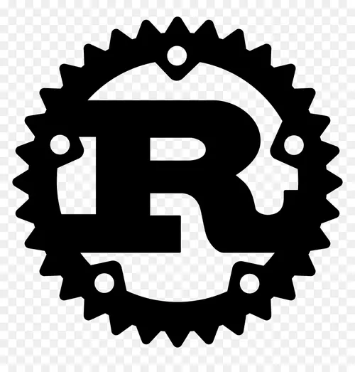

## Project 
Smart Contract Validator.

## Overview
This project implements a smart contract system that validates,
stores, and executes agreement logic on-chain using deterministic rules.

## Problem
Smart contracts are difficult to audit and prone to logical errors.

## Solution
Introducing a rule-based validator layer with invariant checks. 
Can be used through CLI. Later, this will be adapted to a UI through a web application.

## Architecture
The diagram below illustrates the workflow between the UI, validation logic and smart contracts input.  

## Tech Stack
- Backend: Rust  
- Frontend: TypeScript(React)  
  

