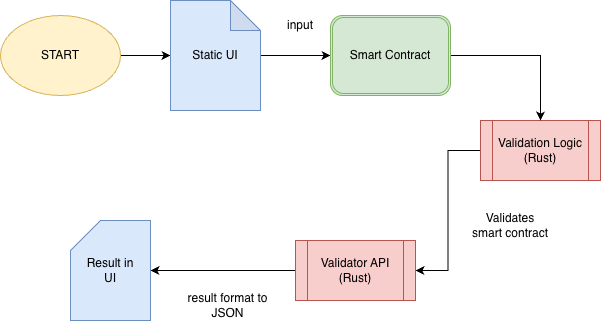

Smart Contract Validator through CLI.

## Overview
This project implements a smart contract system that validates,
stores, and executes agreement logic on-chain using deterministic rules.

## Problem
Smart contracts are difficult to audit and prone to logical errors.

## Solution
Introducing a rule-based validator layer with invariant checks.
Can be used through CLI. Later, this will be adapted to a UI through a web application.

## Architechture
The diagram below illustrates the workflow between the UI, validation logic and smart contracts input. 

## Tech Stack
-Rust
-React JS:
