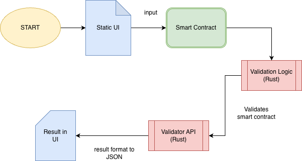
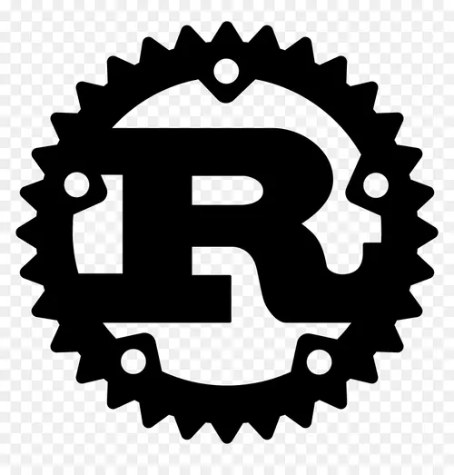

## Project 
Smart Contract Validator.

## Overview
This project implements a smart contract system that validates,
stores, and executes agreement logic on-chain using deterministic rules.

## Problem
Smart contracts are difficult to audit and prone to logical errors.

## Solution
Introducing a rule-based validator layer with invariant checks.<br>
Can be used through CLI. Later, this will be adapted to a UI through a web application.

## Architecture
The diagram below illustrates the workflow between the UI, validation logic and smart contracts input.<br> 

<br>
## Installation + Execution Steps
<h3>Step 1:</h3>
Clone the git repository:

```
git clone https://github.com/JustSid26/SmartContractCLI
```

The file structure should like:

```
.
├── backend
│   ├── src
│   └── target
├── contracts
│   └── counter_contract
├── docs
└── frontend
    ├── app
    ├── lib
    ├── node_modules
    └── public
```
<h3>Step 2:</h3>
Make sure to have rust installed.

For Linux/MacOS users:
```
curl --proto '=https' --tlsv1.2 -sSf https://sh.rustup.rs | sh
```
Check installation(universal):
```
rustup --version
rustc --version
```

For Windows, visit the website given below and download the .exe file for respective systems ->
```
https://rustup.rs/#
```

<h3>Step 3:</h3>
Make sure to have npm installed.

For Linux(Debian) users:
```
sudo apt update
sudo apt install nodejs npm
```
For MacOS users(if homebrew is installed):
```
brew install node
```
For Windows Users, install the .msi file (LTS version):
```
https://nodejs.org/en
```
And then run the installer, keep all default options

Check installation(universal):
```
node -v
npm -v
```

<h3>Step 4:</h3>
Inside the root folder(SmartContractCLI), run the command to install node modules:

```
cd frontend
npm install
```

Then go back to root directory again(SmartContract):
```
cd ..
```
Then run the command(for backend):
```
cd backend
cargo run
```
Make sure port 3000 is not in use.

The terminal should display:
```
Finished `dev` profile [unoptimized + debuginfo] target(s) in 0.45s
Running `target/debug/backend`
Server running at http://0.0.0.0:3000
```
<h3>
Step 5:
</h3>

To run the validator from CLI, go to the root directory(SmartContractCLI) run the command:
```
cd contacts/counter_contract
curl -F "file=@artifacts/counter_contract.wasm" http://localhost:3000/api/validate
```
Output:
```
{"valid":true,"message":"WASM contract passed CosmWasm validation","size_bytes":134639}%  
```
There is an invalid contract in contracts/counter_contract/artifacts, named invalid.wasm
You can check for invalidity too.

To check any other contracts, first put the .wasm file in contracts/counter_contract/artifacts
The run the command:
```
curl -F "file=@artifacts/contract_name.wasm" http://localhost:3000/api/validat
```
Make sure to edit the contract_name.wasm with correct file name.

<h3>Step 6:</h3>
To validate contracts from website(UI), go to root directory(SmartContractCLI), then run:

```
cd frontend
npm run dev -- -p 3001
```

Make sure port 3001 is not being used by the system.

Output:
```
 npm run dev -- -p 3001                                                                                                                                                   ─╯

> frontend@0.1.0 dev
> next dev -p 3001

⚠ Warning: Next.js inferred your workspace root, but it may not be correct.
 We detected multiple lockfiles and selected the directory of /Users/sid/package-lock.json as the root directory.
 To silence this warning, set `turbopack.root` in your Next.js config, or consider removing one of the lockfiles if it's not needed.
   See https://nextjs.org/docs/app/api-reference/config/next-config-js/turbopack#root-directory for more information.
 Detected additional lockfiles: 
   * /Users/sid/Projects/SmartContractCLI/frontend/package-lock.json

▲ Next.js 16.1.6 (Turbopack)
- Local:         http://localhost:3001
```

The in browser, go to ``` http://localhost:3001``` to load the UI and click on Validate.<br>
Choose a file to check (must be .wasm), then click on validate.<br><br>
NOTE: Do make sure that backend is still running on port 3000.
## Tech Stack
- Backend: Rust <br>
- Frontend: TypeScript(React) <br>
  

